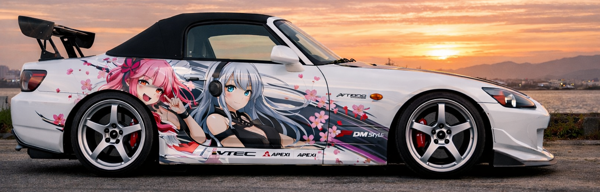

<!-- ====== HEADER ====== -->

  

<h1 align="center"> Ruslan — iOS Developer (Swift) (｡•̀ᴗ-)✧</h1>

  
  
  

---

## ✦ About (ﾉ◕ヮ◕)ﾉ*:･ﾟ✧

| | |
|---|---|
| **Role** | iOS Developer (Swift, UIKit, SwiftUI) |
| **Focus** | Clean architecture, REST, maps, polished UI |
| **Location** | Israel (UTC+2) |
| **Languages** | RU (native), EN (B1→B2) |

---

## ✦ Tech Stack

  
  
  
  
  

---

## ✦ Featured Projects

| Project | What it is | Tech | Link |
|---|---|---|---|
| **Danetka. Think Again.** | Logic riddle card game | SwiftUI, JSON, MVVM | [REPO](https://github.com/animepusya/Yes-No-Game) |
| **MovieQuiz** | Quiz app (course project) | MVP, API | [REPO](https://github.com/animepusya/MovieQuiz) |

---

✨ Extra 

